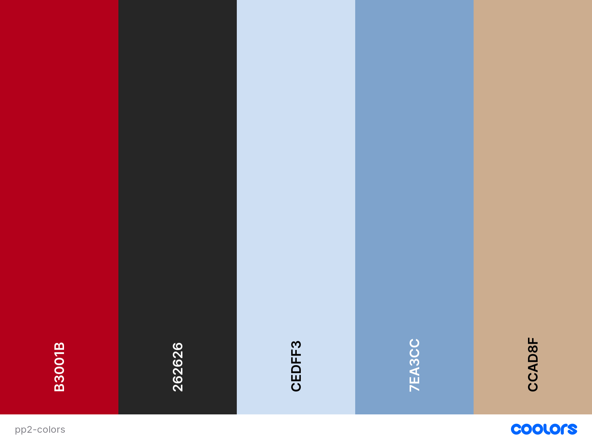
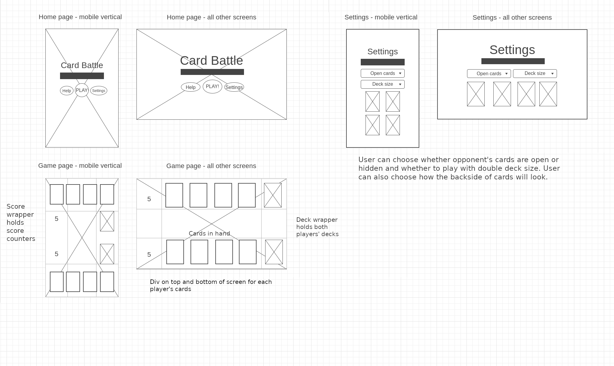

# CARD BATTLE

Card battle is simple card game which, despite its simplicity, challenges the player's brain.

This is a game for people who want something quick and simple that still makes you think.

The goal is to predict the opponent's move and choose the right card to go higher or lower at the right time to win the turn and collect the points.

The game offers a bit of variety in terms of difficulty and round length.

[View the website here](https://emilionr.github.io/card-battle-pp2/)

## Contents

* [Development Process](#development-process)

* [Features](#Features)
  * [Existing Features](#existing-features)
    * [Home page](#home-page)
    * [Game page](#game-page)
  * [Future Implementations](#future-implementations)

* [User Experience](#User-Experience)
  * [User Stories](#User-Stories)

* [Deployment](#Deployment)

* [Design](#Design)
  * [Colour Scheme](#Colour-Scheme)
  * [Typography](#Typography)
  * [Images](#Images)
  * [Wireframe](#wireframe)
  * [Accessibility](#Accessibility)

* [Technologies Used](#Technologies-Used)
  * [Languages Used](#Languages-Used)
  * [Frameworks, Libraries & Programs Used](#frameworks-libraries--programs-used)

* [Testing](#Testing)
  * [Solved Bugs](#solved-bugs)
  * [Known Bugs](#unfixed-bugs)
  
* [Credits](#Credits)
  * [Content](#Content)
  * [Media](#Media)
  * [Tutorials & Code Used](#tutorials--code-used)

## Development Process

I came up with the idea of the game and a general approach for how to make it, making sure to leave space in the planning to figure out new aspects of javascript required to make it work.

The first challenge I encountered was creating a functional method for shuffling the decks. My first attempts gave poor results, with biased shuffling and ignored indices. After analyzing popular array randomizing functions such as the Fisher-Yates shuffle algorithm, I came up with a new solution that works as intended regardless of array size.

Another hurdle I had to overcome was handling the data given by the user and making it persist. I chose to use local storage for this, rather than exporting js modules or lumping everything together in a huge tangle of code.

Throughout the process, I've refactored functions to make them as flexible and non-repetitive as I can. If I want to change the number of cards in hand, the card values, or even the game rules - I can do so by simply changing one or two variables without anything breaking.

## Features

The site has two pages, one for the main menu and one for the game itself.

### Existing Features

#### Home Page:

__The home page has:__

At the main menu, the player can change game settings and open a help window with information about how to play the game.

The settings page lets users adjust the game length and difficulty as well as choose the look of the cards.

#### Game Page:

__The Game page has:__

The game lets the users select cards to play, and the computer plays cards in return. Scores are kept and the game can be repeated or terminated when the player wins or loses.
Animations keep the interest up and lets the player know what to click next.

### Future Implementations:

## User Experience

### User stories

__First-time visitor goals__

* I want to play a fun and casual game without any hassle
* I want to navigate the page with ease
* I want to enjoy this game on any device
* I want clear information about how to play the game

__Returning visitor goals__

* I want to add variety to the game
* I want to keep track of my wins and losses

## Design

### Color palette

I have made a color palette that draws inspiration from a traditional deck of playing cards. The palette is adjusted for good contrast.

### Typography

### Images

### Wireframe

### Accessibility

## Technologies Used

### Languages Used

This website was made with HTML, CSS, and JavaScript.

### Frameworks, Libraries, & Programs used

VSCode - Used for all the coding.

Git - For version control.

GitHub - To store files and provide a live site.

Google Fonts - For stylish headings.

Google Dev Tools - For debugging and trying out design improvements on the fly.

GNU Image Manipulation Program - Cropping and scaling images for faster load times.

Am I Responsive - For testing how the site looks on different devices.

WAVE Evaluation Tool - To check accessibility.

Web Disability Simulator - To check accessibility.

## Deployment

The site is deployed using GitHub Pages

To Deploy the site using GitHub Pages:

1. Sign in to Github.
2. Go to the project repository, [EmilionR/card-battle-pp2](https://github.com/EmilionR/card-battle-pp2/commits/main/).
3. Click the settings button.
4. In the left sidebar, select "pages".
5. From the source dropdown select main branch and click save.
6. The site is now deployed, although it might take a few minutes before the site is live.

### Local Development

#### How to Fork the repository

1. Sign in to GitHub.
2. Go to the repository for this project, [EmilionR/card-battle-pp2](https://github.com/EmilionR/card-battle-pp2/commits/main/)
3. Click the Fork button in the top right corner.

### How to Clone the repository

1. Log in (or sign up) to GitHub.
2. Go to the repository for this project, [EmilionR/card-battle-pp2](https://github.com/EmilionR/card-battle-pp2/commits/main/)
3. Click on the code button, select whether you would like to clone with HTTPS, SSH or GitHub CLI and copy the link shown.
4. Open the terminal in your code editor and change the current working directory to the location you want to use for the cloned directory.
5. Type 'git clone' into the terminal and then paste the link you copied in step 3. Press enter.

## Testing

Please refer to [TESTING.md](TESTING.md) for testing documentation.

### Solved Bugs

1. There was a bug that would crash the site when initalizing the game on some browsers. I fixed it by storing certain variables in local storage rather than passing them between javascript files.

### Unfixed Bugs

## Credits

### Content

All content is original.

### Media

**Images used**

main-bg.jpg - Royalty free  [photo by Zoran Kokanovic](https://unsplash.com/photos/silhouette-photo-of-mountains-surrounded-by-fogs-GJYQfEfRpSg?utm_content=creditCopyText&utm_medium=referral&utm_source=unsplash) on Unsplash

### Tutorials & Code Used
