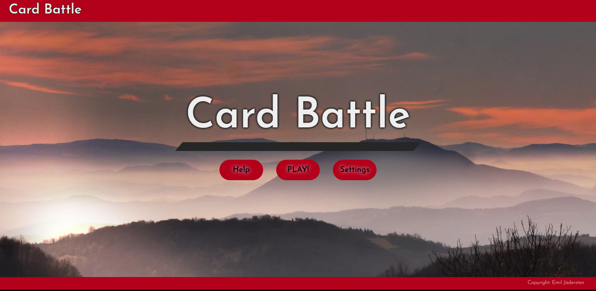
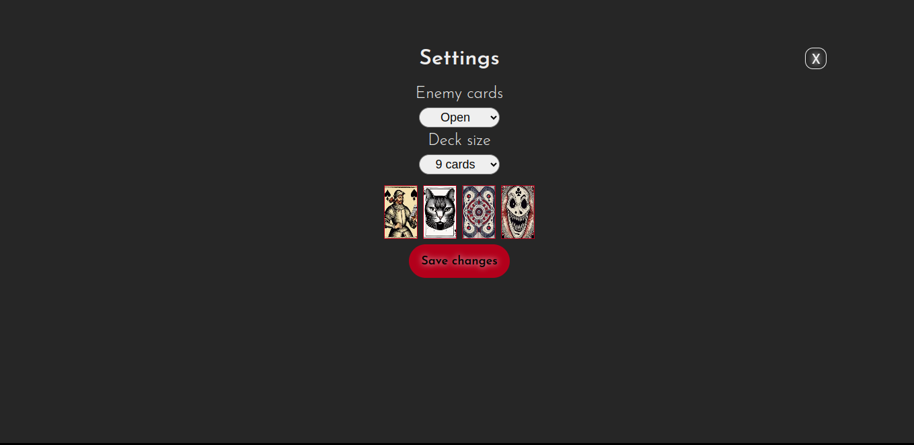
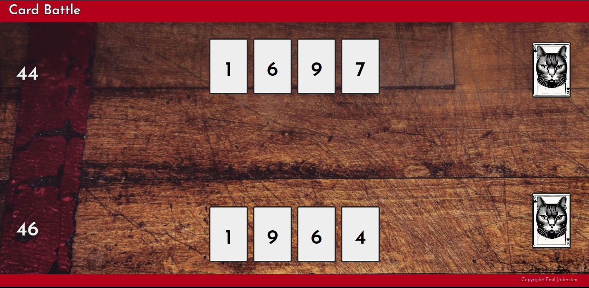

# CARD BATTLE

Card battle is simple card game which, despite its simplicity, challenges the player's brain.

This is a game for people who want something quick and simple that still makes you think.

The goal is to predict the opponent's move and choose the right card to go higher or lower at the right time to win the turn and collect the points.

The game offers a bit of variety in terms of difficulty and round length.

[View the website here](https://emilionr.github.io/card-battle-pp2/)

## Contents

* [Development Process](#development-process)

* [Features](#Features)
  * [Existing Features](#existing-features)
    * [Home page](#home-page)
    * [Game page](#game-page)
  * [Future Implementations](#future-implementations)

* [User Experience](#User-Experience)
  * [User Stories](#User-Stories)

* [Deployment](#Deployment)

* [Design](#Design)
  * [Colour Scheme](#Colour-Scheme)
  * [Typography](#Typography)
  * [Images](#Images)
  * [Wireframe](#wireframe)
  * [Accessibility](#Accessibility)

* [Technologies Used](#Technologies-Used)
  * [Languages Used](#Languages-Used)
  * [Frameworks, Libraries & Programs Used](#frameworks-libraries--programs-used)

* [Testing](#Testing)
  * [Solved Bugs](#solved-bugs)
  * [Known Bugs](#unfixed-bugs)
  
* [Credits](#Credits)
  * [Content](#Content)
  * [Media](#Media)
  * [Tutorials & Code Used](#tutorials--code-used)

## Development Process

I came up with the idea of the game and a general approach for how to make it, making sure to leave space in the planning to figure out new aspects of javascript required to make it work.

The first challenge I encountered was creating a functional method for shuffling the decks. My first attempts gave poor results, with biased shuffling and ignored indices. After analyzing popular array randomizing functions such as the Fisher-Yates shuffle algorithm, I came up with a new solution that works as intended regardless of array size.

Another hurdle I had to overcome was handling the data given by the user and making it persist. I chose to use local storage for this, rather than exporting js modules or lumping everything together in a huge tangle of code.

The biggest issue was finding a good way to make the turns flow, due to how javascript doesn't do things in sequence unless absolutely forced to do so in roundabout ways. I dealt with this by making the script stop until it gets user input.

Throughout the process, I've refactored functions to make them as flexible and non-repetitive as I can. If I want to change the number of cards in hand, the card values, or even the game rules - I can do so by simply changing one or two variables without anything breaking.

## Features

The site has two pages, one for the main menu and one for the game itself.

### Existing Features

#### Home Page:

__The home page has:__

At the main menu, the player can change game settings and open a help window with information about how to play the game. Each of these features has its dedicated button. Clicking the "help" button opens a modal with gameplay instructions, clicking "play" starts the game, and clicking "settings" opens another modal where the player can change the game settings.

The settings screen lets users adjust the game length and difficulty as well as choose the look of the cards. You can choose whether you want to see what card the opponent has in hand or not. You can also choose whether to play with 9 or 18 cards. And last, you can choose between four different designs for the back of the cards.

#### Game Page:

__The Game page has:__

The game lets the users select cards to play, and the computer plays cards in return. Scores are kept and the game can be repeated or terminated when the player wins or loses.
Animations keep the interest up and lets the player know what to click next. For example, your cards lift up and glow when you hover over them during your turn.

### Future Implementations:

In the future, I may add a second type of cards that will play differently. Rather than playing for straight value, they would have special effects such as simply stealing a card or drawing a new hand of cards.

## User Experience

### User stories

__First-time visitor goals__

* I want to play a fun and casual game without any hassle
* I want to navigate the page with ease
* I want to enjoy this game on any device
* I want clear information about how to play the game

__Returning visitor goals__

* I want to add variety to the game
* I want to keep track of my wins and losses

## Design

### Color palette

I have made a color palette that draws inspiration from a traditional deck of playing cards. The palette is adjusted for good contrast.

### Typography

For this game, I wanted a simple and stylized font that can work for every text element throughout the project. I wanted somethign that looks a little more organic than a standard linear font but still neat and consistent. The font I've chosen is a Google webfont called 'Josefin Sans.'

### Images

I wanted very simple imagery for this project. A standard landscape background for the menu page, a playing board for the game page, and a stylish image for the backside of the playing cards. The latter, 

### Wireframe

### Accessibility

## Technologies Used

### Languages Used

This website was made with HTML, CSS, and JavaScript.

### Frameworks, Libraries, & Programs used

VSCode - Used for all the coding.

Git - For version control.

GitHub - To store files and provide a live site.

Google Fonts - For stylish headings.

Google Dev Tools - For debugging and trying out design improvements on the fly.

GNU Image Manipulation Program - Cropping and scaling images for faster load times.

Am I Responsive - For testing how the site looks on different devices.

WAVE Evaluation Tool - To check accessibility.

Web Disability Simulator - To check accessibility.

## Deployment

The site is deployed using GitHub Pages

To Deploy the site using GitHub Pages:

1. Sign in to Github.
2. Go to the project repository, [EmilionR/card-battle-pp2](https://github.com/EmilionR/card-battle-pp2/commits/main/).
3. Click the settings button.
4. In the left sidebar, select "pages".
5. From the source dropdown select main branch and click save.
6. The site is now deployed, although it might take a few minutes before the site is live.

### Local Development

#### How to Fork the repository

1. Sign in to GitHub.
2. Go to the repository for this project, [EmilionR/card-battle-pp2](https://github.com/EmilionR/card-battle-pp2/commits/main/)
3. Click the Fork button in the top right corner.

### How to Clone the repository

1. Log in (or sign up) to GitHub.
2. Go to the repository for this project, [EmilionR/card-battle-pp2](https://github.com/EmilionR/card-battle-pp2/commits/main/)
3. Click on the code button, select whether you would like to clone with HTTPS, SSH or GitHub CLI and copy the link shown.
4. Open the terminal in your code editor and change the current working directory to the location you want to use for the cloned directory.
5. Type 'git clone' into the terminal and then paste the link you copied in step 3. Press enter.

## Testing

Please refer to [TESTING.md](TESTING.md) for testing documentation.

### Solved Bugs

1. There was a bug that would crash the site when initalizing the game on some browsers. I fixed it by storing certain variables in local storage rather than passing them between javascript files.

2. When starting another round, the final scores from last round would be visible until the end of the first turn. By changing the way the game updates these score counters, I got it back in order.

3. Mobile screens would get very inconsistent layouts of game elements, especially the player hand. After a lot of fine-tuning things back and forth, I managed to find a happy medium that should work well on all viable screen sizes.

### Unfixed Bugs

Browser consoles may warn about an error with the Permissions-Policy header. However, this is a GitHub issue and not a bug in the site itself.

## Credits

### Content

All content is original.

### Media

**Images used**

"main-bg.webp" - Royalty free  [photo by Zoran Kokanovic](https://unsplash.com/photos/silhouette-photo-of-mountains-surrounded-by-fogs-GJYQfEfRpSg?utm_content=creditCopyText&utm_medium=referral&utm_source=unsplash) on Unsplash

"board.webp" Royalty free  [photo by Tim Mossholder](https://unsplash.com/photos/shallow-focus-photography-of-brown-parquet-flooring-ysDq0fY-bzo?utm_content=creditCopyText&utm_medium=referral&utm_source=unsplash) on Unsplash
  

### Tutorials & Code Used

I used no tutorials for this project. But I did read some documentation from MDN Web Docs and W3Schools at times, to get the CSS styling to behave how I wanted.