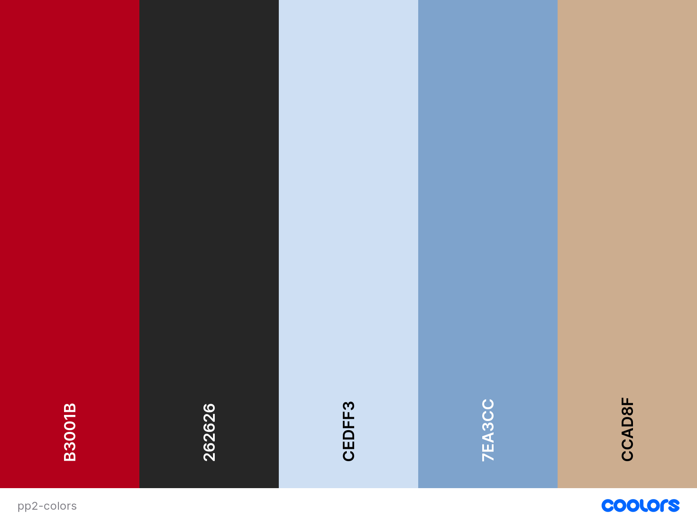

# CARD BATTLE

Card battle is simple card game which, despite its simplicity, challenges the player's brain.

This is a game for people who want something quick and simple that still makes you think.

The goal is to predict the opponent's move and choose the right card to go higher or lower at the right time to win the turn and collect the points.

The game offers a bit of variety in terms of difficulty and round length.

[View the website here]()

## Contents

* [Features](#Features)
  * [Existing Features](#existing-features)
    * [Home page](#home-page)
  * [Future Implementations](#future-implementations)

* [User Experience](#User-Experience)
  * [User Stories](#User-Stories)

* [Deployment](#Deployment)

* [Design](#Design)
  * [Colour Scheme](#Colour-Scheme)
  * [Typography](#Typography)
  * [Images](#Images)
  * [Wireframe](#wireframe)
  * [Accessibility](#Accessibility)

* [Technologies Used](#Technologies-Used)
  * [Languages Used](#Languages-Used)
  * [Frameworks, Libraries & Programs Used](#frameworks-libraries--programs-used)

* [Testing](#Testing)
  * [Solved Bugs](#solved-bugs)
  * [Known Bugs](#unfixed-bugs)
  
* [Credits](#Credits)
  * [Content](#Content)
  * [Media](#Media)
  * [Tutorials & Code Used](#tutorials--code-used)

## Features

### Existing Features

#### Home Page:

__The home page has:__

#### Game Page:

__The Game page has:__

#### Settings Page:

__The settings page has:__

### Future Implementations:

## User Experience

__Key information for the site__

### User stories

__Client goals__

__First-time visitor goals__

__Returning visitor goals__

## Design

### Color palette

I have made a color pallette that draws inspiration from a traditional deck of playing cards.

### Typography

### Images

### Wireframe

### Accessibility

## Technologies Used

### Languages Used

This website was made with HTML, CSS, and JavaScript.

### Frameworks, Libraries, & Programs used

VSCode - Used for all the coding.

Git - For version control.

GitHub - To store files and provide a live site.

Google Fonts - For stylish headings.

Google Dev Tools - For debugging and trying out design improvements on the fly.

GNU Image Manipulation Program - Cropping and scaling images for faster load times.

Am I Responsive - For testing how the site looks on different devices.

WAVE Evaluation Tool - To check accessibility.

Web Disability Simulator - To check accessibility.

## Deployment

The page was deployed with GitHub Pages, using the following procedure:
1. First, go to the Settings tab of this repository.
2. Select the Master branch from the source section dropdown menu.
3. The page automatically refreshes and confirms the successful deployment.ment

## Testing

Please refer to [TESTING.md](TESTING.md) for testing documentation.

### Solved Bugs

### Unfixed Bugs

## Credits

### Content

All content is original.

### Media

**Images used**

### Tutorials & Code Used

