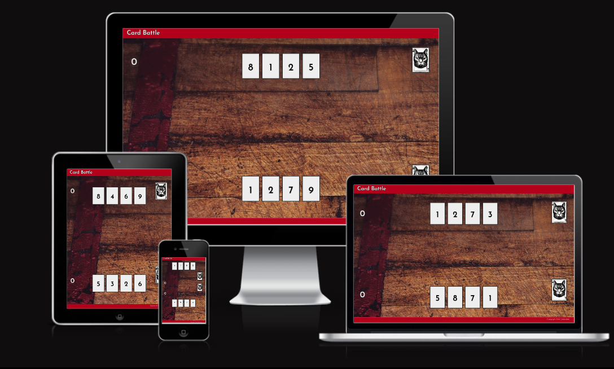
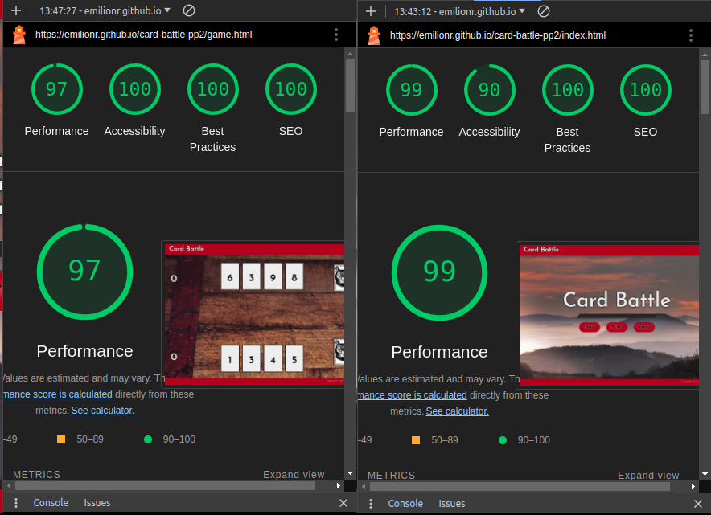
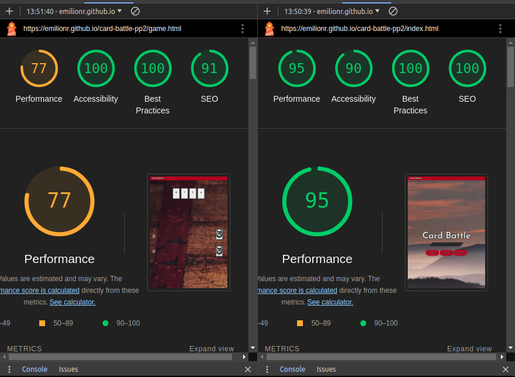

# ELION GYM - TESTING

Visit live deployed site: [Elion Gym](https://emilionr.github.io/card-battle-pp2/game.html)

* [Automated Testing](#automated-testing)
  * [Validator Testing](#validator-testing)
  * [Lighthouse](#lighthouse)
* [Manual Testing](#manual-testing)
  * [Testing User Stories](#testing-user-stories)
  * [Full Testing](#full-testing)

## Automated Testing

### Validator Testing

This project has been validated using W3C validators for HTML and CSS, plus JSHint for JavaScript.

* HTML
  * https://validator.w3.org/nu/?doc=https%3A%2F%2Femilionr.github.io%2Fcard-battle-pp2%2Findex.html
  * https://validator.w3.org/nu/?doc=https%3A%2F%2Femilionr.github.io%2Fcard-battle-pp2%2Fgame.html

* CSS
  * https://jigsaw.w3.org/css-validator/validator?uri=https%3A%2F%2Femilionr.github.io%2Fcard-battle-pp2%2Findex.html&profile=css3svg&usermedium=all&warning=1&vextwarning
  * https://jigsaw.w3.org/css-validator/validator?uri=https%3A%2F%2Femilionr.github.io%2Fcard-battle-pp2%2Fgame.html&profile=css3svg&usermedium=all&warning=1&vextwarning

* JavaScript
  

### Lighthouse

I used Lighthouse from the Chromium developer tools to check the performance, accessibility, best practices, and SEO of the site.

__Desktop results__

All four scores are in the green, which means they are good. While the accessibility of the menu page comes in at 90, this is mostly due to a false positive in the assessment of poor contrast. This happens because Lighthouse does not always factor in borders, shadows, and other styling effects. I have placed backgrounds, shadows, and outlines on everything that could use some extra contrast, and the resulting actual contrast is very high.

__Mobile results__

The performance score for the game page takes a hit due to slower page loading on mobile devices. This is in part due to Lighthouse's emulation of the weak internet connections we used to associate with mobile phones. The main culprits for the slower loading time are the webfont and the background image.

## Manual Testing

### Testing User Stories

__First Time Visitors__

| Goals | How are they achieved? |
| :--- | :--- |
| I want to play a fun and casual game without any hassle | The game is straightforward and can be started with a single click. Rematches also only require the click of a button. |
| I want to navigate the page with ease | The site is very simple and navigation is intuitive and streamlined. |
| I want to enjoy this game on any device | The design is fully responsive and tested on different devices. |
| I want clear information about how to play the game | There's a "help" section with clear instructions on the menu page, and in the game there are visual cues to show the player what to click next. |

__Returning Visitors__

|  Goals | How are they achieved? |
| :--- | :--- |
| I want to add variety to the game | The game has some options for difficulty, round length, and visual style. |
| I want to keep track of my wins and losses | The current numbers of wins and losses are displayed after each round. |

### Full Testing

The site was tested on these devices:
* Computer:
  * Thinkpad 480t
* Mobile
  * Samsung Galaxy S22
  * Samsung Galaxy S23
  * Samsung Galaxy S9
  
The site was also tested in a number of browsers, including:
* Google Chrome
* Mozilla Firefox
* Brave
* Microsoft Edge
* Opera
* Safari

__Menu Page__

| Feature | Expected Outcome | Testing Performed | Result | Pass/Fail |
| --- | --- | --- | --- | --- |
| "PLAY" button | Button should take the user to the game page and initiate a round of the game | Click the button | Game loads as intended | Pass |
| "Help" button | The help modal should open | Click the button | Help modal opens | Pass |
| "X" button | Button should close the open modal | Click the button | The modal closes | Pass |
| "Settings" button | The settings modal should open | Click the button | Settings modal opens | Pass |
| Cardback selection | Cardbacks should glow when hovered over and selected | Try selecting each cardback | Cards glow as intended | Pass |
| "Save changes" button | Clicking it should save the selected options to local storage and close the modal | Click the button with every combination of settings | Settings are saved and the modal closes | Pass |

__Game Page__

| Feature | Expected Outcome | Testing Performed | Result | Pass/Fail |
| --- | --- | --- | --- | --- |
| Player settings | The settings chosen in the menu should be applied | Try every combination of settings and start the game with each | The chosen cardback, deck size, and card orientation are applied | Pass |
| Player's cards | Clicking a card should play it to the table | Click the cards | Cards play to the table | Pass |
| Card clickability toggling | ards are only clickable when it's the player's turn | Click cards during every stage | Cards only react to clicking when intended. | Pass |
| Card hover effect | Playable cards should light up and lift up when in hover state | Hover on all cards to check the effect | Cards light up and lift up as intended | Pass |
| Opponent's cards | Opponents cards should not be clickable | Click opponent's cards | Cards are not clickable | Pass |
| "Next turn" button | Button should end the current turn and initiate the next turn | Click the button throughout several games | Turns cycle as intended | Pass |
| Card comparison | Card value should be calculated and awarded to the right player after each turn | Play several rounds of the game | Cards compare correclty, the correct sum is added to the correct player | Pass |
| Decks | Card decks should vanish when all cards have been drawn | Draw all cards | Decks vanish | Pass |
| Score counters | Score counters update scores correctly when cards are played | Play a number of games | Score counters always update correctly | Pass |
| Cardbacks | Cards should have the selected image on the back side | Start the game with each cardback selected, refresh page during game | Cardbacks display as intended | Pass |
| Game Over modal | The heading should display whether you win, lose, or tie | Play the game with different outcomes | Heading displays the right message | Pass |
| Win/lose counter | The message should display the correct number of wins and losses after each round | Play several rounds | Message shows correct number of wins and losses | Pass |
| "Yes" button | Button should start a new round of the game | Click the button after several games | Game restarts correctly | Pass |
| "No" button | Button should take user back to the main menu | Click the button after several games | Exits to the main menu | Pass |